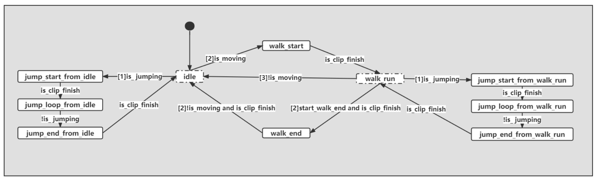

# Games104_Homework

## 作业2

### 题目

在小引擎代码中找到 `pilot/engine/shader/glsl/color_grading.frag`，补充此 `shader` 代码中的` main `函数，以实现` ColorGrading `功能。若代码编译成功且实现方法正确，则可以看到进行 `ColorGrading `渲染之后的结果。 

### 思路

- 根据原始颜色在LUT找到对应的颜色位置，做一些插值即可

### 实现

~~~glsl
void main()
{
    highp ivec2 lut_tex_size = textureSize(color_grading_lut_texture_sampler, 0);
    //原始颜色
    highp vec4 color = subpassLoad(in_color).rgba;
    //LUT的长
    highp float _LutSize      = float(lut_tex_size.y);
    //像素大小
    highp float _SpriteSize = 1.0/_LutSize;
    //LUT的宽
    highp float texWidth = float(lut_tex_size.x);
    //找到b的LUT位置
    highp float v = color.b * (_LutSize - 1.0);
    highp float f_v = floor(v);
    highp float c_v = ceil(v);
    //三通道的 b 分别存放 floor color ，ceil color ，alpha
    highp vec3 b = vec3(f_v * _SpriteSize, c_v * _SpriteSize, (v - f_v));
    //找到r，g在LUT 一个block里的位置
    highp float r = color.r * (_LutSize - 1.0) * (1.0/texWidth);
    highp float g = color.g * (_LutSize - 1.0) * _SpriteSize * (1.0/texWidth);
	//插值避免过度明显
    highp vec2 luv = vec2(r + b.x, g);
    highp vec3 lw = texture(color_grading_lut_texture_sampler, luv).rgb;
    highp vec2 huv = vec2(r + b.y, g);
    highp vec3 hw = texture(color_grading_lut_texture_sampler, huv).rgb;
    highp vec3 ret = mix(lw, hw, b.z);
    out_color = vec4(ret.rgb, 1.0);
}
~~~

### 效果


## 作业3

### 题目

1. 在 Pilot 小引擎代码中找到 pilot/engine/source/runtime/runtime/function/animation/pose.cpp，找到blend函数补充代 码，实现动画融合。
2.  在 Pilot 小引擎代码中找到 pilot/engine/source/runtime/runtime/function/animation/animation_FSM.cpp，找到update 函数补充代码，实现机器人走跑跳状态机。
3. 在 Pilot 小引擎代码中找到 pilot/engine/source/runtime/function/controller/character_controller.cpp，找到move函数修 改代码，利用SceneQuery实现具有相对真实物理表现的character controller：如可跳至平台上， 跳起后空中碰到墙壁可以落回地面，前进碰到墙壁可以自动调整位移方向等。

### 实现

1. ~~~cpp
   void AnimationPose::blend(const AnimationPose& pose)
   {
       for (int i = 0; i < m_bone_poses.size(); i++)
       {
           auto&       bone_trans_one = m_bone_poses[i];
           const auto& bone_trans_two = pose.m_bone_poses[i];
   
           float sum_weight = m_weight.m_blend_weight[i] + pose.m_weight.m_blend_weight[i];
           if (sum_weight != 0)
           {
               float cur_weight = pose.m_weight.m_blend_weight[i];
               m_weight.m_blend_weight[i] = sum_weight;
               float alpha                = cur_weight / sum_weight; 
               bone_trans_one.m_position  = Vector3::lerp(bone_trans_one.m_position, bone_trans_two.m_position, alpha);
               bone_trans_one.m_scale     = Vector3::lerp(bone_trans_one.m_scale, bone_trans_two.m_scale, alpha);
               bone_trans_one.m_rotation  =
                   Quaternion::nLerp(alpha, bone_trans_one.m_rotation, bone_trans_two.m_rotation, true);
           }
       }
   }
   ~~~

   注意点：

   

2. 只要根据给的状态机填写条件即可

```cpp
bool AnimationFSM::update(const json11::Json::object& signals)
    {
        States last_state     = m_state;
        bool   is_clip_finish = tryGetBool(signals, "clip_finish", false);
        bool   is_jumping     = tryGetBool(signals, "jumping", false);
        float  speed          = tryGetFloat(signals, "speed", 0);
        bool   is_moving      = speed > 0.01f;
        bool   start_walk_end = false;

        //状态机根据signals以及update函数内部的逻辑更新当前状态m_state，update函数已经留空
        switch (m_state)
        {
            case States::_idle:
                /**** [0] ****/
                if (is_jumping)
                {
                    m_state = States::_jump_start_from_idle;
                }
                else if (is_moving)
                {
                    m_state = States::_walk_start;
                }

                break;
            case States::_walk_start:
                /**** [1] ****/
                if (is_clip_finish)
                {
                    m_state = States::_walk_run;
                }
                break;
            case States::_walk_run:
                /**** [2] ****/
                if (is_jumping)
                {
                    m_state = States::_jump_start_from_walk_run;
                }
                else if (start_walk_end && is_clip_finish)
                {
                    m_state = States::_walk_stop;
                }
                else if (!is_moving)
                {
                    m_state = States::_idle;
                }
                break;
            case States::_walk_stop:
                /**** [3] ****/
                if (!is_moving && is_clip_finish)
                {
                    m_state = States::_idle;
                }
                break;
            case States::_jump_start_from_idle:
                /**** [4] ****/
                if (is_clip_finish)
                {
                    m_state = States::_jump_loop_from_idle;
                }
                break;
            case States::_jump_loop_from_idle:
                /**** [5] ****/
                if (!is_clip_finish)
                {
                    m_state = States::_jump_end_from_idle;
                }
                break;
            case States::_jump_end_from_idle:
                /**** [6] ****/
                if (is_clip_finish)
                {
                    m_state = States::_idle;
                }
                break;
            case States::_jump_start_from_walk_run:
                /**** [7] ****/
                if (is_clip_finish)
                {
                    m_state = States::_jump_loop_from_walk_run;
                }
                break;
            case States::_jump_loop_from_walk_run:
                /**** [8] ****/
                if (!is_clip_finish)
                {
                    m_state = States::_jump_end_from_walk_run;
                }
                break;
            case States::_jump_end_from_walk_run:
                /**** [9] ****/
                if (is_clip_finish)
                {
                    m_state = States::_walk_run;
                }
                break;
            default:
                break;
        }
        return last_state != m_state;
    }
```

3. 正常使用auto step实现，这里简化步进式上台阶，直接设置为上0.5

```cpp
    Vector3 CharacterController::move(const Vector3& current_position, const Vector3& displacement)
    {
        std::shared_ptr<PhysicsScene> physics_scene =
            g_runtime_global_context.m_world_manager->getCurrentActivePhysicsScene().lock();
        ASSERT(physics_scene);

        std::vector<PhysicsHitInfo> hits;

        Transform world_transform = Transform(
            current_position + 0.1f * Vector3::UNIT_Z,
            Quaternion::IDENTITY,
            Vector3::UNIT_SCALE);

        //垂直
        Vector3 vertical_displacement   = displacement.z * Vector3::UNIT_Z;
        //水平
        Vector3 horizontal_displacement = Vector3(displacement.x, displacement.y, 0.f);

        Vector3 vertical_direction   = vertical_displacement.normalisedCopy();
        Vector3 horizontal_direction = horizontal_displacement.normalisedCopy();

        Vector3 final_position = current_position;

        hits.clear();
        
        world_transform.m_position -= 0.1f * Vector3::UNIT_Z;

        // vertical pass
            
            
            if (physics_scene->sweep(m_rigidbody_shape,
                                     world_transform.getMatrix(),
                                     vertical_direction,
                                     vertical_displacement.length(),
                                     hits))
            {
                final_position += hits[0].hit_distance * vertical_direction;
            }
            else
            {
                final_position += vertical_displacement;
            }

            hits.clear();

            // side && slide pass
            // bug ：模型 卡顿
            if (physics_scene->sweep(m_rigidbody_shape,
                                     world_transform.getMatrix(),
                                     horizontal_direction,
                                     horizontal_displacement.length(),
                                     hits) &&
                hits.size() == 1)
            {
                final_position += (horizontal_direction - hits[0].hit_normal) * 0.01f;
            }
            else
            {
                final_position += horizontal_displacement;
            }
            hits.clear();


            // Go up the steps
            // bug：乱跳，且能穿墙了
            bool isOnSteps = false;
            std::vector<PhysicsHitInfo> newhit;
            if (physics_scene->sweep(m_rigidbody_shape,
                                     world_transform.getMatrix(),
                                     horizontal_direction,
                                     horizontal_displacement.length(),
                                     hits))
            {

                    float i = 0.5;
                    Vector3 start_position {hits[0].hit_position.x, hits[0].hit_position.y, hits[0].hit_position.z + i};
                    

                    if (physics_scene->raycast(start_position, horizontal_direction, 1.f, newhit))
                    {
                        if (newhit[0].hit_distance > hits[0].hit_distance)
                        {
                            final_position.z += i;
                            isOnSteps = true;
                        }
                    }
            }
            hits.clear();
            newhit.clear();

            m_is_touch_ground = isOnSteps? true : physics_scene->sweep(
                m_rigidbody_shape, world_transform.getMatrix(), Vector3::NEGATIVE_UNIT_Z, 0.105f, hits);

        return final_position;
    }
```

### 问题

- 在墙边行走会抖动

- 上台阶的实现导致和墙的碰撞出现问题。
- 上台阶会一直跳


- 这一part日后有待完善，等等大佬们的解

